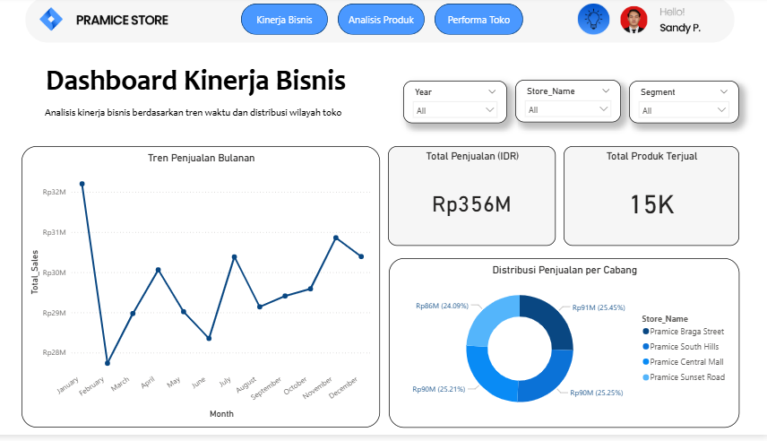
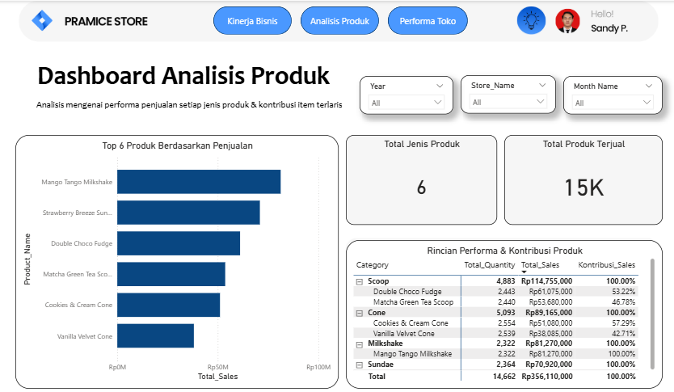

# Dashboard Business Intelligence untuk Analisis Penjualan Pramice Store

**Final Project — DQLab Business Intelligence Analyst Bootcamp**

## Project Overview

Proyek akhir DQLab Business Intelligence Analyst Bootcamp yang mengembangkan dashboard Business Intelligence untuk mengolah, menganalisis, dan memvisualisasikan data penjualan Pramice Store secara interaktif.

## Objectives

* Menganalisis kinerja penjualan dan kondisi bisnis.
* Mengidentifikasi produk berdasarkan performa penjualan.
* Membandingkan performa toko berdasarkan data penjualan.

## Tools & Technologies

* Microsoft Excel
* Power Query
* Power BI

## Data Processing

Data penjualan diolah menggunakan Power Query dalam Power BI untuk melakukan proses transformasi dan persiapan data sebelum divisualisasikan dalam dashboard.

## Dashboard Pages

### 1. Kinerja Bisnis

Menampilkan ringkasan kinerja bisnis berdasarkan metrik penjualan yang tersedia.

### 2. Analisis Produk

Menyajikan analisis penjualan berdasarkan produk untuk melihat performa masing-masing produk.

### 3. Performa Toko

Menyajikan perbandingan performa toko berdasarkan data penjualan.

## Dashboard Preview

### Kinerja Bisnis

### Analisis Produk

### Performa Toko

## Project Information

**Program:** DQLab Business Intelligence Analyst Bootcamp
**Project:** Final Project
**Dataset:** Dummy Dataset
**Status:** Completed
